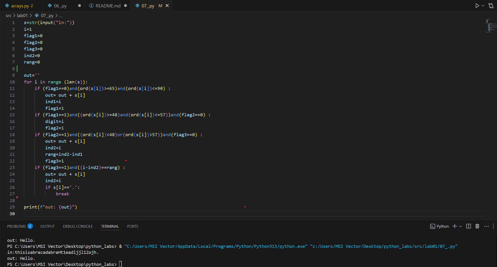

# python_labs

## Лабораторная работа 1

### Задание 1
```
name=str(input("Имя:"))
age=int(input("Возраст:"))
print(f"Привет, {name}! Через год тебе будет {age+1} ")
```

### Задание 2
```
a=float(input("a:"))
b=float(input("b:"))
sum= a+b
avg= sum / 2
print(f"sum {sum:.2f}; avg= {avg:.2f}")")
```

### Задание 3
```
price=float(input())
discount=float(input())
vat=float(input())
base= price * (1 - discount/100)
vat_amount= base * (vat/100)
total = base + vat_amount
print(f"База послес скидки:{base:.2f} ₽\nНдс:{vat_amount:.2f} ₽\nИтого к оплате:{total:.2f} ₽\n")
```

### Задание 4
```
m=int(input("Минуты:"))
hh=m // 60
mm=m % 60
print(f"{hh}:{mm}")
```

### Задание 5
```
fio=str(input("ФИО: "))
new_fio=fio.split()
fio_new=f"{new_fio[0]} {new_fio[1]} {new_fio[2]}"
res=f"{new_fio[0][0]}{new_fio[1][0]}{new_fio[2][0]}."
len=len(fio_new)
print(f"Инициалы: {res} \nДлина:{len}")

```


### Задание 6
```
n=int(input())
och=0
zaoch=0
for i in range (n):
    s=input().split()
    if s[3]=="True":
        och+=1
    else:
        zaoch+=1
print(f"out: {och} {zaoch}")
```


### Задание 7
```
s=str(input("in:"))
i=1
flag1=0
flag2=0
flag3=0
ind2=0
rang=0
out=''
for i in range (len(s)):
    if (flag1==0)and(ord(s[i])>=65)and(ord(s[i])<=90) :
        out= out + s[i]
        ind1=i
        flag1=1
    if (flag1==1)and((ord(s[i])>=48)and(ord(s[i])<=57))and(flag2==0) :
        digit=i
        flag2=1
    if (flag2==1)and((ord(s[i])<48)or(ord(s[i])>57))and(flag3==0) :
        out= out + s[i]
        ind2=i
        rang=ind2-ind1
        flag3=1
    if (flag3==1)and((i-ind2)==rang) :
        out= out + s[i]
        ind2=i
        if s[i]=='.':
            break
print(f"out: {out}")
```

